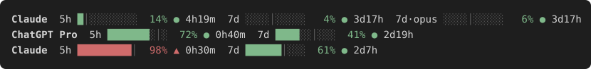

# usage-limit-tracker

A [pi](https://github.com/badlogic/pi-mono) / [oh-my-pi](https://github.com/can1357/oh-my-pi) extension that shows a usage-limit bar for **every subscription you are logged into** — Claude (5h / 7d), ChatGPT Codex (5h / 7d), and any other OAuth provider oh-my-pi reports on.



One line per subscription, below the editor. Colors reflect **risk**, not raw percent:

- `│` marks how much of the window has elapsed. Fill left of the tick = under pace.
- Color = risk of hitting the limit before reset. It combines how full the bucket is, your projected finish at the current rate, and how far ahead of linear pace you are. Early-window bursts are damped.
- `●` chill / on track, `▲` warning / hot.
- Palette is muted by default (`sage → amber → dusty red`). `vivid` and `pastel` are available.

## Install

**oh-my-pi**

```sh
omp install npm:pi-usage-limit-tracker
```

`omp install` needs `bun` on your PATH for npm sources. Without it, clone this repo and run `omp plugin link ./usage-limit-tracker`.

**pi**

```sh
pi install npm:pi-usage-limit-tracker      # or: pi install git:github.com/mattstrayer/usage-limit-tracker@v0.1.0
```

Or copy `index.ts` + `src/` into `~/.pi/agent/extensions/usage-limit-tracker/` (pi) or `~/.omp/agent/extensions/usage-limit-tracker/` (omp).

No runtime dependencies. Node 22+ (the host runs TypeScript directly).

## Where the numbers come from

| Host | Primary | Fill-in |
|---|---|---|
| oh-my-pi | Rate-limit response headers on every reply | `authStorage.fetchUsageReports()` — omp's own usage subsystem, covers every logged-in provider |
| pi | Rate-limit response headers on every reply | `GET api.anthropic.com/api/oauth/usage` and `GET chatgpt.com/backend-api/wham/usage` with the OAuth tokens pi already holds |

Headers: `anthropic-ratelimit-unified-{5h,7d}-{utilization,reset}` and `x-codex-{primary,secondary}-{used-percent,window-minutes,reset-at}`.

Polling runs at start and every 5 minutes; the display re-renders every minute so countdowns move. Bars for a provider appear as soon as any data arrives. API-key logins do not expose quota, so they show nothing.

## Commands

The command is `/limits`, not `/usage` — oh-my-pi already ships a built-in `/usage` (`show` / `reset`).

| Command | Effect |
|---|---|
| `/limits` | Refresh now and print a plain-text breakdown with the data source |
| `/limits toggle` | Hide / show the widget |
| `/limits palette muted\|vivid\|pastel` | Switch colors |

Env: `USAGE_LIMITS_HIDDEN=1` starts hidden. `USAGE_LIMITS_PALETTE=vivid` sets the palette. `USAGE_LIMITS_DEBUG=1` logs provider/limit ids to stderr (never tokens).

## Development

```sh
npm test        # node --test, zero deps
npm run demo    # print sample lines
npm run svg     # regenerate docs/demo.svg (README image)
omp -e ./index.ts   # or: pi -e ./index.ts
```

Layout:

- `src/smart-color.ts` — risk model, palettes, HSB ramp (pure)
- `src/render.ts` — bar/line rendering (pure)
- `src/sources/` — header parsers, Anthropic + Codex usage APIs, omp report adapter
- `src/store.ts` — per-provider merge
- `src/extension.ts` — host wiring (events, widget, timers, `/limits`)

Adding a provider: write a parser that returns a `Subscription` (`src/types.ts`) and call `store.upsert` from a header hook or the poll.

## Related

- The risk-based coloring is inspired by [TokenEater](https://github.com/AThevon/TokenEater), a macOS menu-bar usage monitor.

MIT
